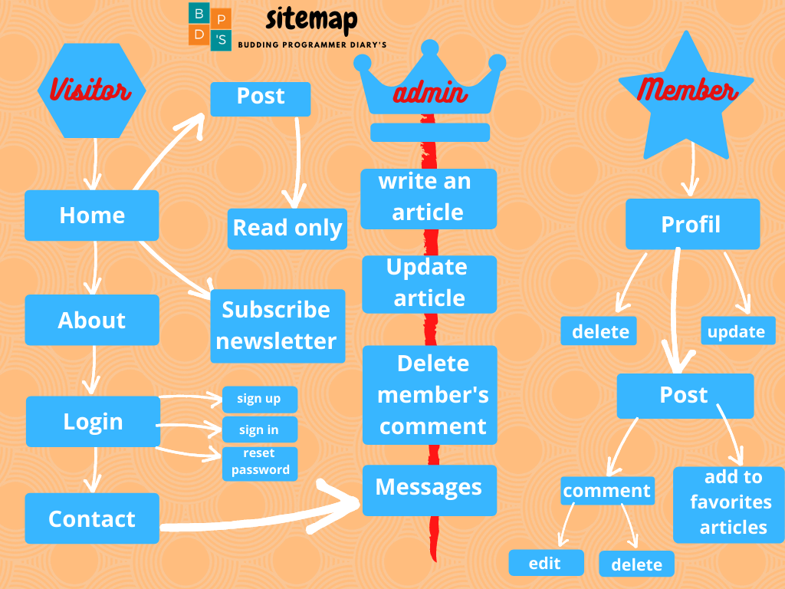

# BUDDING PROGRAMMER DIARY'S : https://www.bpdiarys.com/
## Graduation project 

* ### [The application's features](#the-applications-features-)
* ### [Development process](#development-process-)	
* ### [Programming concepts applied](#programming-concepts-applied-)

## The application's features :

## Development process :
 * This web site is an upgrade version of a personal blog.
* The administrator is allowed to post an article ou update an existing one via a form with the possibility to attach a photo.
* Send an email to members after posting an article.
* A customized markdown enables the writer to format his text.  A javascript function will style the post after retrieving it from the database.
* The posts are available for read-only. The members have the permit to comment on the post, delete the comment, and also save a favorite article in the section favorites articles.
* The administrator is authorized to access and delete the messages sent via the contact form.
* Handle form validation in both frontend and backend.
* Manage security issues.
* Create a mood board web design.
* Create a customized error page.
* use the htaccess file to manage the URLs.
* Scalability: enable members to post an article after the administrator validation.

## Programming concepts applied :

CSS | javascript|PHP|MySQL
----|------------|------|-----------
positions|array methods|superglobals $_POST| create database
flexbox|DOM methods|superglobals $_GET| database queries|
responsive web design|DOM document|   superglobals $_FILES|SQL Data Types
animations|regex|array methods |SQL Dates|
CSS Selectors |Ajax|loop foreach|SQL PRIMARY KEY 
| |JSON|condition(if/else)|SQL FOREIGN KEY|
| |condition(if/else)|PHP filters|SQL Joins|
| | string methods | PHP file|		
| | | PHP sessions|
| | | PHP include|
| | |PHP mail()|
| | | PHP exceptions|
| | | string methods|
| | | PHP PDO|

